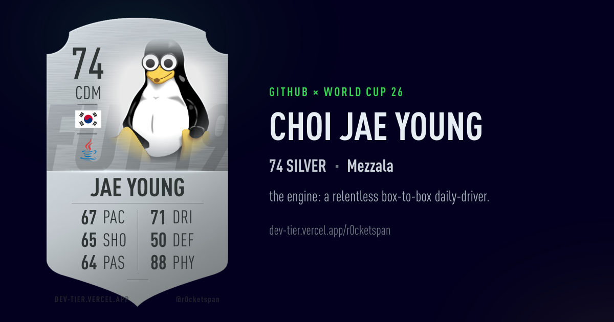

# 🎙️ Speech AI Research Engineer

**실시간 다국어 음성 처리 · 다국어 언어감지(LID) · 생성형 AI**

## 🧑‍💻 About Me

연구소에서 **음성인식(STT)** · **다국어 언어감지(LID)** 분야의 연구개발을 담당하며, 여기에 **AI 서비스를 결합한 솔루션**을 설계·개발하고 있습니다.
**실시간 다국어 STT**와 **다국어 LID**를 메인으로 연구하며, **생성형 AI 챗봇 / RAG 시스템**의 설계·구축·운영까지 경험했습니다.

- 🎙️ **Speech** — Selvy STT(상용) · Faster Whisper(CTranslate2 변환 실시간 모델) · Cloud STT(ElevenLabs, Google STT) 기반 실시간 다국어 STT 시스템 구축·운영
- 🌐 **LID** — ECAPA-TDNN 임베딩 + 자체 학습 MLP 분류기 기반 언어 감지 모듈 개발 (영어 / 일본어 / 중국어 / 러시아어 / 태국어 / 인도네시아어 / 베트남어) 및 LID 모델 자체 파인튜닝 경험
- 🤖 **Generative AI** — 실시간 STT 전사 결과 기반 상담 요약·분류, 오인식 보정·번역, 사용자 질문 의도 분류 → RAG / sLLM(Gemma3, Ollama) 분기 QnA 챗봇 설계·구축

---

## 🔬 Currently Working On

- 🚀 **다국어 STT 고도화** — 도메인 환경에서의 인식 정확도 / 실시간 지연시간 / 언어 전환 안정성 개선
- 🎤 **음색 기반 화자인식** — 도메인 음성 데이터로 파인튜닝한 화자 임베딩을 활용하여 음색 기반 화자 분리·식별 정밀도 향상
- 🧠 **Cumulative LID 아키텍처 설계 및 개발** — ECAPA-TDNN 임베딩 기반 누적 언어식별 구조 설계 (단일 세그먼트 LID의 불안정성을 보완하기 위해 화자·채널 단위 프로파일과 시간 가중 누적 히스토리를 결합)

---

## 🏭 Production / Deployment

실제 콜센터 현장에 다국어 실시간 STT 시스템을 도입하여 **설계 → 구축 → 운영 → 고도화**까지 전 과정을 담당했습니다.

- 🇰🇷 **외교부 영사콜센터** — 한국어 / 영어 실시간 STT 도입·구축·운영 *(2025.08 ~ 2025.12)*
  - 전화망(8kHz)·교환기(H.323) 환경 대응 음성 전처리(노이즈 제거) 및 콜/언어 감지 파이프라인 구성
  - 언어별 STT 분기: **Selvy STT(상용, 한국어)** + **Faster Whisper(Self-hosted, 영어)** 하이브리드
  - **Gemma3:4b** 기반 전사 후처리(오인식 보정 · 번역) + 영사콜센터 빈출 키워드 추출 → 클릭 시 사내 **KMS 연동**
  - VAD → STT → LID → 코드스위칭 화면 출력까지 end-to-end 운영, **WER 기반 STT 품질 검증 체계** 수립

- 🧭 **한국관광공사 1330 관광안내콜센터** — 8개 언어 실시간 STT 도입·구축·운영 *(2025.08 ~ 2026.02)*
  - 8개 언어(한국어 / 영어 / 일본어 / 중국어 / 러시아어 / 태국어 / 인도네시아어 / 베트남어) 실시간 STT
  - **음성 임베딩(ECAPA-TDNN) + 자체 학습 MLP 분류기** 기반 실시간 LID로 언어별 STT 엔진 자동 라우팅
  - 언어별 조사·어미·기능어 스코어링 **2차 언어 검증 로직**으로 라우팅 정확도 보강
  - STT 분기: **Selvy STT(한국어)** / **ElevenLabs STT(그 외 언어)** 하이브리드
  - 문맥 기반 도메인 단어 치환(**xlm-roberta-large**, 단순 1:1이 아닌 문맥 판단 치환) + 망 분리 대응 DMZ 중계 서버(**Nginx**) 경유 **OpenAI(gpt-4o-mini)** 번역 연동
  - 통역사 중계 통화(상담원 / 통역사 / 외국인 화자 동시 처리) 환경 대응

- 🔧 **1330 관광통역안내 상담시스템 유지보수** — 전화상담 AI 요약 · 안내유형 자동 분류 *(2026.06 ~ 진행 중)*
  - 전화상담 종료 시그널을 트리거로 내부망 STT 관리 서버와 API 연동, 상담 건 ↔ STT 전사 결과 매핑 구조 설계
  - STT 전사 결과 기반 프롬프트 설계로 **상담 내용 자동 요약 · 안내유형 자동 분류** 구현
  - 콜 종료 후 상담사가 수행하던 후처리(요약·분류)를 AI로 자동화 → 후처리 시간 단축·상담 집중도 향상

- 🤗 **Hugging Face 모델 파인튜닝 및 운영 적용**
  - 콜센터 도메인 음성 데이터를 활용해 **Whisper / WavLM / ECAPA-TDNN** 등 사전학습 모델을 파인튜닝
  - 학습 → 평가(EER 등) → 변환(CTranslate2) → 실시간 추론 서버 배포까지 일괄 진행

---

## 🛠️ Tech Stack

#### 🥇 Main — *실무 메인*

`Languages & Frameworks`

`Speech / ML`

-1A73E8?style=for-the-badge&logoColor=white)

-FF6F00?style=for-the-badge&logoColor=white)

-9C27B0?style=for-the-badge&logoColor=white)
-FFB300?style=for-the-badge&logoColor=black)

#### 🥈 Sub — *실무 활용 경험*

`Cloud STT / Generative AI`

-412991?style=for-the-badge&logo=openai&logoColor=white)
-000000?style=for-the-badge&logo=ollama&logoColor=white)

-4169E1?style=for-the-badge&logo=postgresql&logoColor=white)

`Audio / Data / Frontend`

`Build / Ops`

#### 🤖 AI Tools

---

<h1 align="left">💻GitHub Analytics</h1>

  

